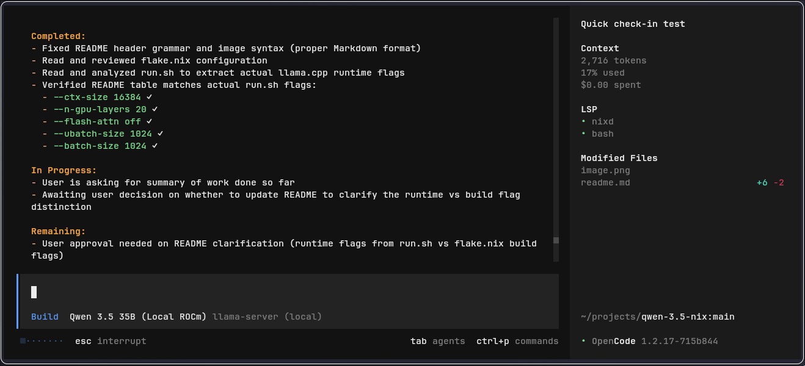

# Local LLM for NixOS

Optimized for **AMD RX 6800XT / Ryzen 7900X** with 32GB RAM.



## 🚀 Quick Start

### Agentic workflows 
To start the LLM server and the Pi agent:
```bash
nix-develop .#agentic
```
This starts a `llama-server` on `http://127.0.0.1:8080` and launches the `pi.dev` TUI pointing to it.

### llama.cpp chat interface 
```bash
nix-develop .#ui
```
This starts a `llama-server` on `http://0.0.0.0:8080` or `http://<local_ipv4>:8080`

---

## 📥 Model Installation

Download models into organized subdirectories within `./models/`. This structure allows `llama-server` to automatically discover models when using `--models-dir ./models --models-preset models.ini`.

### Gemma 4 26B (MoE)
*Active parameters: ~4B. High speed, efficient reasoning.*
```bash
nix shell nixpkgs#python313Packages.huggingface-hub -c huggingface-cli download \
  unsloth/gemma-4-26B-A4B-it-GGUF \
  gemma-4-26B-A4B-it-Q8_0.gguf \
  --local-dir ./models/gemma-4-26b
```

#### multimedia projector aka image gen additional download
```bash
nix shell nixpkgs#python313Packages.huggingface-hub -c huggingface-cli download \
  unsloth/gemma-4-26B-A4B-it-GGUF \
  mmproj-BF16.gguf \
  --local-dir ./models/gemma-4-26b/multimodal
```

### Qwen 3.5 35B (MoE)
*Active parameters: ~3B. Extremely fast Mixture of Experts model.*
[Hugging Face Link](https://huggingface.co/unsloth/Qwen3.5-35B-A3B-GGUF)
```bash
nix shell nixpkgs#python313Packages.huggingface-hub -c huggingface-cli download \
  unsloth/Qwen3.5-35B-A3B-GGUF \
  Qwen3.5-35B-A3B-Q5_K_M.gguf \
  --local-dir ./models/qwen3.5-35b
```

### Qwen 3.5 27B (Dense)
*Full parameter computation for consistent depth and reasoning.*
[Hugging Face Link](https://huggingface.co/unsloth/Qwen3.5-27B-GGUF)
```bash
nix shell nixpkgs#python313Packages.huggingface-hub -c huggingface-cli download \
  unsloth/Qwen3.5-27B-GGUF \
  Qwen3.5-27B-Q4_K_M.gguf \
  --local-dir ./models/qwen3.5-27b
```

---

## ⚙️ Hardware Optimizations (AMD GPU)

To maximize performance on **AMD RDNA2** hardware, these configurations are applied via `llama-common.sh`:

### Environment Variables
| Variable | Purpose | Benefit |
| :--- | :--- | :--- |
| `HIP_VISIBLE_DEVICES=0` | Selects discrete GPU only (ignores iGPU) to ensure full VRAM availability for model weights. | Prevents resource conflicts and ensures max memory usage. |
| `GPU_ENABLE_WGP_MODE=0` | Forces scheduling at individual Compute Unit level rather than Workgroup Processors. | Improved math utilization and better layer distribution on RDNA2. |
| `AMD_VULKAN_ICD=RADV`  | Uses RADV Vulkan ICD instead of AMD's proprietary driver. | Better compatibility/performance with `llama.cpp`. |

### llama-server Flags
| Flag | Description | Optimization Goal |
| :--- | :--- | :--- |
| `--flash-attn on`     | Enables Flash Attention.                                     | Faster inference and reduced memory overhead.           |
| `--mlock`              | Locks model in RAM.                                           | Prevents OS swapping; ensures consistent latency.        |
| `--cache-type-k/v q8_0`* | Quantized KV Cache (varies by model).                         | Significantly reduces VRAM usage for large contexts.     |
| `--threads 11`         | Fixed CPU thread count optimized for the host architecture.  | Optimized core utilization.                             |
| `--no-webui`           | Disables Web UI to minimize overhead.                        | Focuses resources on API and Agent performance.          |

-----

### M1 Mac 8gb

Install Nix via [Determinate](https://github.com/DeterminateSystems/determinate)

### Gemma 4 E2B
*TODO: What does the E mean*
```bash
nix run nixpkgs#python313Packages.huggingface-hub -- download \
  unsloth/gemma-4-E2B-it-GGUF \
  gemma-4-E2B-it-Q4_K_M.gguf \
  --local-dir ./models/gemma-4-e2b
```

#### multimedia projector aka image gen additional download
```bash
nix run nixpkgs#python313Packages.huggingface-hub -- download \
  unsloth/gemma-4-E2B-it-GGUF \
  mmproj-BF16.gguf \
  --local-dir ./models/gemma-4-e2b/multimodal
```

### Run for a llama-ui with Gemma E2B with image/audio support
```bash
nix develop
```